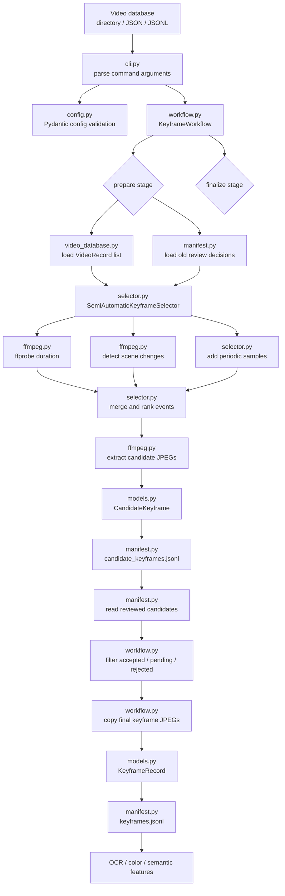
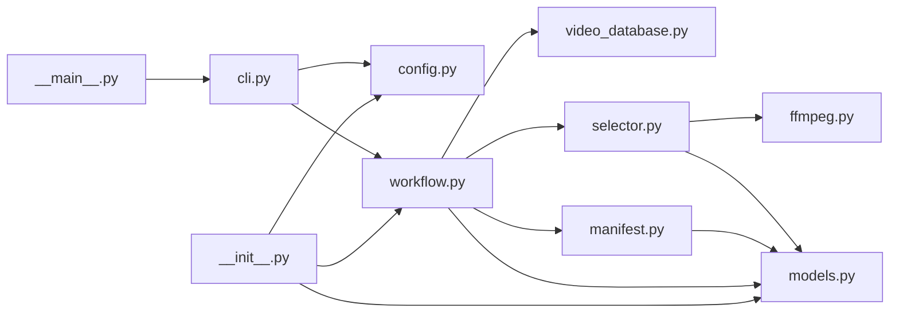

# Keyframes Pipeline

This package implements the IMSearch-inspired path from a video database to:

1. semi-automatic keyframe candidate selection
2. reviewed final keyframe export

The workflow uses ffmpeg scene-change scores plus periodic sampling. It writes a
JSONL review manifest so a UI or human reviewer can mark each candidate as
`accepted`, `rejected`, or `pending` before final export.

## Processing Flow



## Module Flow



## File Responsibilities

- `__main__.py`: entrypoint for `python -m keyframes`.
- `cli.py`: defines `prepare`, `finalize`, and `run` commands, then builds config
  objects from CLI flags.
- `config.py`: Pydantic configuration and validation for selection/finalization
  parameters.
- `workflow.py`: orchestration layer. `prepare()` creates candidate keyframes;
  `finalize()` creates reviewed final keyframes; `run()` executes both stages.
- `video_database.py`: loads videos from a directory, `.json`, or `.jsonl`
  manifest into `VideoRecord` objects.
- `selector.py`: creates candidate timestamps from seed frame, scene changes,
  and periodic sampling; merges nearby candidates; extracts candidate frames.
- `ffmpeg.py`: small adapter around `ffmpeg` and `ffprobe` for duration probing,
  scene detection, and JPEG extraction.
- `models.py`: shared records for source videos, candidate keyframes, and final
  keyframes.
- `manifest.py`: reads and writes JSONL manifests for candidate and final
  keyframe records.
- `README.md`: package usage notes and architecture diagrams.

## Input Video Database

The input can be:

- a directory of videos
- a `.json` manifest
- a `.jsonl` manifest

Manifest rows may be either a path string or an object:

```json
{"video_id": "video_001", "path": "videos/video_001.mp4", "metadata": {"split": "train"}}
```

Supported extensions: `.avi`, `.m4v`, `.mkv`, `.mov`, `.mp4`, `.mpeg`, `.mpg`,
`.webm`.

## Run

Prepare candidates only:

```sh
cd /home/long/Documents/AIC/aic-pipeline/backend
uv run python -m keyframes prepare /path/to/video_database --output /tmp/aic-keyframes
```

Review the generated file:

```text
/tmp/aic-keyframes/manifests/candidate_keyframes.jsonl
```

Then finalize:

```sh
uv run python -m keyframes finalize \
  /tmp/aic-keyframes/manifests/candidate_keyframes.jsonl \
  --output /tmp/aic-keyframes
```

Run both stages in one pass:

```sh
uv run python -m keyframes run /path/to/video_database --output /tmp/aic-keyframes
```

## Output Layout

```text
output/
  candidates/<video_id>/*.jpg
  keyframes/<video_id>/*.jpg
  manifests/candidate_keyframes.jsonl
  manifests/keyframes.jsonl
```

`keyframes.jsonl` is the handoff point for later OCR, dominant color, and
semantic feature extraction blocks.
