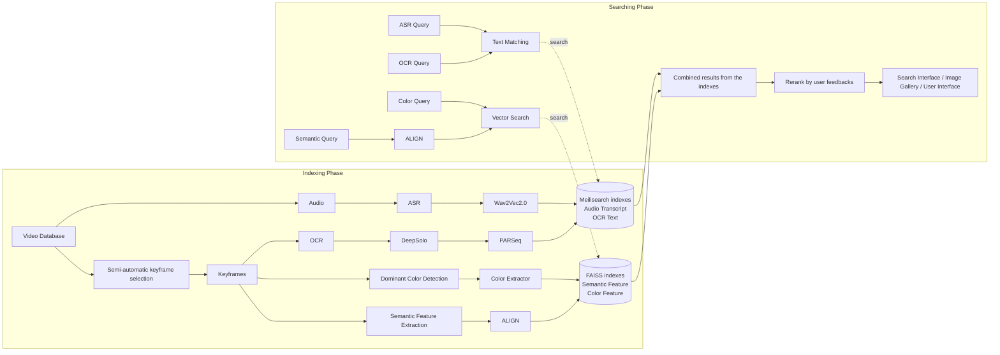

# Reference Flow v1

Tài liệu này chuyển sơ đồ trong seminar thành flow text để dùng làm chuẩn tham chiếu khi triển khai trong repo.

## Nguồn và độ tin cậy

- `[Verified]` Sơ đồ gốc nằm ở `Seminar-HCMAIC26.pdf`, trang PDF `44`.
- `[Verified]` Các slide liên quan trực tiếp gồm:
  - trang `46-48`: keyframe selection và embedding encoding;
  - trang `49-54`: indexing, vector database, OCR storage;
  - trang `55-56`: online retrieve;
  - trang `58-59`: failure cases cho fine-grained search.
- `[Inferred]` Những phần gắn với task `VQA` và `TRAKE` là phần mở rộng hợp lý từ flow retrieval, vì sơ đồ gốc chủ yếu mô tả browser/search system.

## 1. Ý tưởng cốt lõi của flow v1

- `[Verified]` Chia rõ `Indexing Phase` và `Searching Phase`.
- `[Verified]` Tách `text indexes` và `vector indexes` thành hai nhánh riêng.
- `[Verified]` Ở nhánh text, sơ đồ dùng `Meilisearch indexes` để lưu `Audio Transcript` và `OCR Text`.
- `[Verified]` Ở nhánh vector, sơ đồ dùng `FAISS indexes` để lưu `Semantic Feature` và `Color Feature`.
- `[Verified]` Kết quả từ nhiều index được hợp nhất rồi mới `Rerank by user feedbacks`.
- `[Inferred]` Đây là kiến trúc `multi-signal retrieval`, không phải "một embedding model giải hết".

## 2. Flow tham chiếu

## 3. Giải thích module theo pha

### 3.1 Indexing phase

| Module | Trạng thái | Vai trò |
| --- | --- | --- |
| `Video Database` | `[Verified]` | nguồn raw video |
| `Audio -> ASR -> Wav2Vec2.0` | `[Verified]` | trích transcript để text matching |
| `Semi-automatic keyframe selection` | `[Verified]` | giảm số frame cần index và truy vấn |
| `OCR -> DeepSolo -> PARSeq` | `[Verified]` | phát hiện và nhận dạng text trong frame |
| `Dominant Color Detection -> Color Extractor` | `[Verified]` | tạo feature về màu sắc |
| `Semantic Feature Extraction -> ALIGN` | `[Verified]` | tạo feature semantic cho vector search |
| `Meilisearch indexes` | `[Verified]` | lưu transcript và OCR text |
| `FAISS indexes` | `[Verified]` | lưu semantic feature và color feature |

### 3.2 Searching phase

| Module | Trạng thái | Vai trò |
| --- | --- | --- |
| `ASR Query`, `OCR Query` | `[Verified]` | truy vấn text trực tiếp vào text index |
| `Semantic Query` | `[Verified]` | encode query semantic qua `ALIGN` |
| `Color Query` | `[Verified]` | search theo màu hoặc filter theo màu |
| `Text Matching` | `[Verified]` | exact/fuzzy retrieval trên transcript/OCR |
| `Vector Search` | `[Verified]` | nearest-neighbor search trên semantic/color feature |
| `Combined results from the indexes` | `[Verified]` | hợp nhất kết quả nhiều nguồn |
| `Rerank by user feedbacks` | `[Verified]` | tinh chỉnh kết quả theo tín hiệu người dùng |
| `User Interface` | `[Verified]` | duyệt kết quả và gửi query tiếp theo |

## 4. Cách hiểu đúng sơ đồ

### 4.1 Điều sơ đồ khẳng định

- `[Verified]` Text retrieval và vector retrieval là hai đường độc lập nhưng hội tụ ở bước combine.
- `[Verified]` `OCR` không bị xem là metadata phụ; nó là một index hạng nhất.
- `[Verified]` `Audio transcript` cũng là một index hạng nhất.
- `[Verified]` `Color feature` được giữ riêng thay vì nhét chung hoàn toàn vào semantic embedding.

### 4.2 Điều cần suy ra thêm khi triển khai

- `[Inferred]` Sơ đồ không nói rõ schema record; mỗi keyframe nên có ID thống nhất để join text hit, vector hit, metadata và timestamp.
- `[Inferred]` Sơ đồ không nói rõ rerank function; v1 có thể dùng weighted score đơn giản trước khi đi xa hơn.
- `[Inferred]` Sơ đồ không bao trùm phần answer generation cho `VQA`; đó là layer nằm sau retrieval.
- `[Inferred]` Sơ đồ cũng chưa mô tả rõ temporal alignment cho `TRAKE`; cần thêm module sequence assembly sau top-k retrieval.

## 5. Mapping theo task của HCM AIC 2026

### Textual KIS

- `[Verified]` Cần ít nhất nhánh `semantic`, `OCR`, `ASR`.
- `[Inferred]` V1 nên fan-out query sang cả text index và vector index rồi hợp nhất.

### Visual KIS

- `[Verified]` Có thể dùng trực tiếp nhánh semantic/vector.
- `[Inferred]` Nên mở rộng sang temporal neighborhood của keyframe để tìm đúng frame hơn.

### VQA

- `[Verified]` Seminar công bố đây là một task chính thức.
- `[Inferred]` Kiến trúc v1 nên xem VQA là `retrieve first, answer later`.

### TRAKE

- `[Verified]` Seminar công bố đây là một task chính thức.
- `[Inferred]` Kiến trúc v1 nên xem TRAKE là `decompose event -> retrieve each event -> enforce temporal order`.

## 6. Áp dụng cho repo này theo tinh thần KISS

- `[Inferred]` Giữ `FAISS` cho semantic/color vector index ở giai đoạn đầu.
- `[Inferred]` Giữ một text index riêng cho `OCR` và `ASR`, vì đó là quyết định đã bám sát sơ đồ nhất.
- `[Inferred]` Không nên dựng ngay một hệ sinh thái microservice; chỉ cần tách rõ:
  - pipeline offline;
  - index artifacts;
  - retrieval service;
  - evaluation loop.
- `[Inferred]` Khi chưa có UI hoàn chỉnh, có thể mô phỏng bước `user feedback rerank` bằng manual relevance labels hoặc notebook-driven analysis.

## 7. Khi nào cần nâng từ v1

- `[Inferred]` Khi `FAISS` không còn đủ vì filtering phức tạp hoặc dữ liệu tăng mạnh.
- `[Inferred]` Khi OCR nhỏ, crop-level retrieval hoặc duplicate handling trở thành bottleneck rõ ràng.
- `[Inferred]` Khi cần browser interactive cho vòng chung kết và latency trở thành tiêu chí chính thức.
