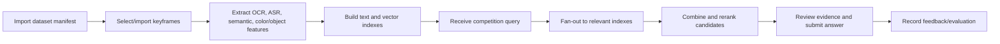

# BRDS 02 - Business workflow

## End-to-end workflow

## Workflow theo stage

| Stage | Actor | Trigger | Input | Business action | Output | State transition | Rules | Acceptance |
|---|---|---|---|---|---|---|---|---|
| Dataset intake | `PipelineOperator` | Có bộ video/metadata mới | Manifest, raw video path, metadata | Validate danh mục video và định danh canonical. | `CorpusAsset` hợp lệ | `DRAFT -> READY` | BR-02, BR-11 | AC-01 |
| Keyframe preparation | `SystemJob` | Corpus ready | Video asset hoặc keyframe có sẵn | Sinh/import keyframe và map về video/frame/time. | Keyframe catalog | `INDEX_RUN: QUEUED -> RUNNING -> SUCCEEDED` | BR-01, BR-02 | AC-02 |
| ASR indexing | `SystemJob` | Audio hoặc transcript có sẵn | Audio, segment config | Trích transcript và đưa vào text index. | ASR index artifact | `ARTIFACT: BUILDING -> ACTIVE` | BR-03, BR-11, BR-12 | AC-03 |
| OCR indexing | `SystemJob` | Keyframe ready | Keyframe image | Detect/recognize scene text và index. | OCR index artifact | `ARTIFACT: BUILDING -> ACTIVE` | BR-03, BR-11, BR-12 | AC-04 |
| Vector indexing | `SystemJob` | Keyframe ready | Keyframe image, feature config | Sinh semantic/color feature và FAISS index. | Vector index artifact | `ARTIFACT: BUILDING -> ACTIVE` | BR-03, BR-11, BR-12 | AC-05, AC-06 |
| Query intake | `CompetitorUser` | Có câu hỏi từ đề thi | Task type, query text/image, filters | Chuẩn hóa query và chọn nhánh retrieval. | Query session | `QUERY: DRAFT -> RUNNING` | BR-07 | AC-07 |
| Multi-index retrieval | `SystemJob` | Query validated | Normalized query | Fan-out vào text/vector index và giữ evidence từng nhánh. | Candidate hit list | `QUERY: RUNNING -> COMBINING` | BR-03, BR-04 | AC-08 |
| Fusion/rerank | `SystemJob` | Có hit list | Scores, evidence, weights | Merge theo `video_id/frame_id/timestamp_ms`, rerank deterministic. | Ranked results | `QUERY: COMBINING -> READY` | BR-04, BR-05, BR-06 | AC-09 |
| Textual KIS review | `CompetitorUser` | Ranked results ready | Candidate list | Duyệt evidence và chọn `VideoId`, `FrameId`. | Submission draft | `SUBMISSION: DRAFT -> READY` | BR-02, BR-07 | AC-10 |
| TRAKE assembly | `SystemJob` | Query type `TRAKE` | Sub-event query list | Retrieve từng sub-event, enforce temporal order. | Ordered frame sequence | `QUERY: COMBINING -> READY` | BR-08 | AC-11 |
| VQA answering | `SystemJob` | Query type `VQA` | Question, candidates, evidence | Trích evidence và sinh answer ngắn có căn cứ. | Answer with evidence | `QUERY: COMBINING -> READY` | BR-09 | AC-12 |
| Feedback/evaluation | `Evaluator` hoặc `CompetitorUser` | Sau review hoặc benchmark | Labels, selected answer, notes | Ghi feedback không làm thay đổi raw index. | Evaluation record | `FEEDBACK: NEW -> APPLIED_TO_RUN` | BR-10 | AC-13 |

## Exception paths

| Exception | Trigger | Business response | State impact | Trace |
|---|---|---|---|---|
| Manifest thiếu video hoặc trùng ID | Import dataset | Reject manifest, trả reason code và dòng lỗi. | `CorpusAsset` vẫn `DRAFT` | BR-02, AC-01 |
| Một nhánh index lỗi | ASR/OCR/vector job fail | Mark artifact `FAILED`, cho phép rerun nhánh đó, không xóa artifact active cũ. | `IndexRun` có partial failure | BR-12, NFR-09 |
| Query không khớp task type | Query intake | Reject trước retrieval. | `QuerySession` không tạo hoặc `REJECTED` | BR-07, AC-07 |
| Index version không tương thích | Retrieval | Dừng nhánh lỗi, báo `INDEX_VERSION_MISMATCH`, không merge kết quả sai. | `QuerySession` `FAILED` hoặc degraded | BR-11, AC-14 |
| TRAKE không tìm được chuỗi hợp lệ | Temporal assembly | Trả top evidence từng sub-event và reason `TRAKE_ORDER_NOT_FOUND`. | `QuerySession` `READY_WITH_WARNINGS` | BR-08, AC-11 |
| VQA thiếu evidence | Answering | Trả `INSUFFICIENT_EVIDENCE` thay vì bịa answer. | `Answer` `UNANSWERED` | BR-09, AC-12 |

## Workflow priorities

1. MVP phải hoàn thiện luồng Textual KIS trước vì nó bắt buộc semantic, OCR, ASR, fusion và evidence.
2. TRAKE dùng lại retrieval core, chỉ thêm decomposition và temporal assembly.
3. VQA dùng lại retrieval core, chỉ thêm answer layer có căn cứ.
4. Visual KIS được thiết kế contract trước nhưng triển khai sau MVP nếu cần ưu tiên vòng chung kết.

