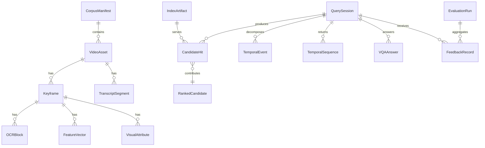

# BRDS 06 - Domain model

## Entity matrix

| Entity | Purpose | Key attributes | Lifecycle | Owner capability | Trace |
|---|---|---|---|---|---|
| `CorpusManifest` | Phiên bản danh mục dữ liệu đầu vào. | `corpus_id`, `version`, `source`, `created_at`, `schema_version` | `DRAFT -> READY -> ARCHIVED` | Dataset & Asset Catalog | FR-01 |
| `VideoAsset` | Video gốc trong corpus. | `video_id`, `path`, `duration_ms`, `metadata_ref`, `checksum` | Theo corpus | Dataset & Asset Catalog | FR-01 |
| `SourceMetadata` | Metadata YouTube/báo/đài nếu có. | `title`, `description`, `channel`, `publish_date`, `keywords` | Immutable theo import | Dataset & Asset Catalog | FR-01 |
| `Keyframe` | Đơn vị truy xuất frame-level. | `keyframe_id`, `video_id`, `frame_id`, `timestamp_ms`, `path` | Created by keyframe run | Dataset & Asset Catalog | FR-02 |
| `FrameLocator` | Định danh canonical để submit hoặc join index. | `video_id`, `frame_id`, `timestamp_ms` | Immutable | Dataset & Asset Catalog | BR-02 |
| `TranscriptSegment` | Text ASR theo khoảng thời gian. | `segment_id`, `video_id`, `start_ms`, `end_ms`, `text`, `confidence` | Created by ASR run | Signal Extraction | FR-03 |
| `OCRBlock` | Text trong keyframe. | `ocr_block_id`, `keyframe_id`, `bbox`, `text`, `confidence` | Created by OCR run | Signal Extraction | FR-04 |
| `FeatureVector` | Vector semantic hoặc color. | `vector_id`, `keyframe_id`, `kind`, `dimension`, `model_version`, `artifact_ref` | Created by vector run | Signal Extraction | FR-05, FR-06 |
| `VisualAttribute` | Thuộc tính màu/object cho filter/rerank. | `keyframe_id`, `color_tags`, `object_labels`, `confidence` | Created by attribute run | Signal Extraction | FR-06 |
| `IndexArtifact` | Artifact text/vector có thể phục vụ query. | `artifact_id`, `kind`, `status`, `schema_version`, `model_version`, `path` | `BUILDING -> ACTIVE/FAILED/DEPRECATED` | Operations | FR-14 |
| `QuerySession` | Một lần giải query từ người dùng hoặc benchmark. | `query_id`, `task_type`, `raw_query`, `normalized_query`, `status` | Query lifecycle | Query Understanding | FR-07 |
| `CandidateHit` | Hit thô từ một branch index. | `hit_id`, `query_id`, `source_branch`, `locator`, `raw_score`, `evidence_ref` | Created during retrieval | Retrieval | FR-08 |
| `RankedCandidate` | Candidate đã fusion/rerank. | `candidate_id`, `locator`, `rank`, `fusion_score`, `score_breakdown` | Created during fusion | Retrieval | FR-09 |
| `TemporalEvent` | Sub-event trong TRAKE. | `event_id`, `query_id`, `order`, `text`, `constraints` | Derived from TRAKE query | TRAKE | FR-11 |
| `TemporalSequence` | Chuỗi frame cho TRAKE. | `sequence_id`, `query_id`, `ordered_locators`, `score` | Generated by TRAKE solver | TRAKE | FR-11 |
| `VQAAnswer` | Answer text có căn cứ. | `answer_id`, `query_id`, `answer_text`, `confidence`, `evidence_refs` | `DRAFT -> ANSWERED/UNANSWERED` | VQA | FR-12 |
| `FeedbackRecord` | Label hoặc phản hồi từ review/evaluation. | `feedback_id`, `query_id`, `target_id`, `label`, `note` | `NEW -> APPLIED_TO_RUN/IGNORED` | Evaluation | FR-13 |
| `EvaluationRun` | Một lần benchmark. | `run_id`, `query_set`, `config_version`, `metrics`, `failure_notes` | Created by evaluator | Evaluation | FR-13 |

## Relationship model

## Business semantics và constraints

- `FrameLocator` là định danh nghiệp vụ quan trọng nhất cho KIS. Mọi candidate user-facing phải có locator.
- `Keyframe` không đồng nghĩa với mọi frame của video. Nếu query cần frame giữa hai keyframe, hệ thống dùng temporal neighborhood map.
- `IndexArtifact` là output bất biến của một index run. Feedback không sửa artifact này.
- `CandidateHit` là hit theo branch; `RankedCandidate` là kết quả sau fusion. Hai khái niệm này không được nhập làm một vì sẽ mất evidence.
- `VQAAnswer` không được tách khỏi evidence. Answer thiếu evidence phải ở trạng thái `UNANSWERED`.
- `TemporalSequence` cho TRAKE phải giữ thứ tự event và locator tương ứng từng event.

## Ubiquitous terms

| Term | Meaning |
|---|---|
| `Corpus` | Tập video/metadata đang được pipeline xử lý. |
| `Keyframe` | Ảnh đại diện cho một vùng thời gian/frame trong video. |
| `Branch` | Một nhánh retrieval hoặc extraction như OCR, ASR, semantic, color. |
| `Evidence` | Text, vector score, color/object hit, hoặc frame preview giải thích vì sao candidate được trả về. |
| `Fusion` | Hợp nhất hit từ nhiều branch thành ranked candidate. |
| `Rerank` | Điều chỉnh thứ tự candidate dựa trên score tổng, feedback hoặc rule task-specific. |
| `Locator` | Bộ `video_id/frame_id/timestamp_ms` dùng để join và submit. |

## Forbidden synonyms

- Không dùng `frame_id` thay cho `keyframe_id` nếu đang nói tới ảnh keyframe.
- Không dùng `result` thay cho cả `CandidateHit` và `RankedCandidate`.
- Không dùng `answer` cho Textual KIS; Textual KIS output là locator.
- Không dùng `metadata` để chỉ OCR/ASR. OCR/ASR là evidence/index hạng nhất.

