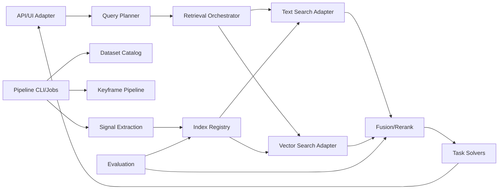

# Technical 00 - System overview

## Purpose

Thiết kế kỹ thuật này chuyển BRDS của pipeline v1 thành module, contract, storage, API, workflow, validation, error và testing plan để triển khai `aic-pipeline` mà không phải đoán thêm nghiệp vụ.

## Verified current repo state

| Item | Status | Notes |
|---|---|---|
| Backend runtime | Verified | `backend/pyproject.toml` yêu cầu Python `>=3.11.3`, dùng `uv_build`. |
| Runtime dependencies | Verified | `dependencies = []`, chưa có FAISS, Meilisearch client, web framework hoặc ML library. |
| Entrypoint | Verified | `aic-pipeline = "aic_pipeline:main"` và `main()` hiện chỉ in greeting mẫu. |
| Existing docs | Verified | `docs/aic-knowledge/` chứa seminar notes, query catalog và reference flow v1. |
| Pipeline modules below | Inferred | Được derive từ BRDS và sơ đồ pipeline, chưa phải code đã tồn tại. |

## Product scope

Technical scope v1 gồm:

- Offline dataset/keyframe/signal extraction/indexing.
- Online query intake, retrieval fan-out, fusion/rerank.
- Task solvers cho Textual KIS, TRAKE, VQA.
- Operations/evaluation để quản lý artifact, feedback và benchmark.
- Contract mở rộng cho Visual KIS nhưng triển khai sau MVP.

## Actors and responsibilities

| Actor | Technical responsibilities | Trace |
|---|---|---|
| `CompetitorUser` | Gửi query, duyệt results, tạo submission draft, gửi feedback. | FR-07, FR-10, FR-11, FR-12 |
| `PipelineOperator` | Import manifest, chạy indexing jobs, xem health. | FR-01..FR-06, FR-14 |
| `Evaluator` | Chạy benchmark query set và label results. | FR-13 |
| `Maintainer` | Quản lý config, schema, artifact compatibility, local setup. | FR-14, NFR-06 |
| `SystemJob` | Thực thi pipeline offline/online theo config đã validate. | FR-02..FR-09 |

## Canonical states

State names mirror BRDS exactly:

- `CorpusAsset`: `DRAFT`, `READY`, `ARCHIVED`
- `IndexRun`: `QUEUED`, `RUNNING`, `SUCCEEDED`, `FAILED`, `CANCELLED`
- `IndexArtifact`: `BUILDING`, `ACTIVE`, `FAILED`, `DEPRECATED`
- `QuerySession`: `DRAFT`, `RUNNING`, `COMBINING`, `READY`, `READY_WITH_WARNINGS`, `FAILED`, `REJECTED`
- `CandidateReview`: `UNSEEN`, `VIEWED`, `SELECTED`, `REJECTED`
- `Submission`: `DRAFT`, `READY`, `EXPORTED`, `VOIDED`
- `Answer`: `DRAFT`, `ANSWERED`, `UNANSWERED`
- `Feedback`: `NEW`, `APPLIED_TO_RUN`, `IGNORED`

## Component map

## Runtime shape v1

| Runtime area | Target | Status |
|---|---|---|
| Backend process | Python package under `backend/src/aic_pipeline`. | Inferred target |
| CLI | `uv run aic-pipeline ...` command groups for import/index/search/eval. | Inferred target |
| Metadata store | SQLite or equivalent local metadata store for catalog, runs, sessions. | Inferred target |
| Vector index | FAISS artifact files for semantic/color vectors. | Inferred from reference flow |
| Text index | Meilisearch or equivalent text index for OCR/ASR. | Inferred from reference flow |
| Raw media | Local filesystem paths from manifest. | Inferred target |
| UI | Minimal API/browser adapter later; CLI/API first. | Inferred target |

## Quality attributes

| Attribute | Technical implication | Trace |
|---|---|---|
| Reproducibility | Artifact manifests must include corpus/config/model/schema versions. | NFR-01, BR-11 |
| Low latency | Online query uses active artifacts only, never full-frame scan. | NFR-02, BR-12 |
| Evidence quality | Candidate response includes source branch, scores and evidence refs. | NFR-03, BR-04 |
| Local-first maintainability | Single backend package and local artifacts before distributed services. | NFR-06 |
| Fault tolerance | Branch-level failures produce warnings when policy allows. | NFR-09, BR-12 |

## Traceability skeleton

| Technical area | BRDS source |
|---|---|
| Dataset/keyframes | FR-01, FR-02, BR-01, BR-02 |
| ASR/OCR/vector/color indexing | FR-03..FR-06, BR-03, BR-11, BR-12 |
| Query/fan-out/fusion | FR-07..FR-09, BR-03..BR-07 |
| Textual KIS/TRAKE/VQA/Visual KIS | FR-10..FR-12, FR-15, BR-07..BR-09 |
| Evaluation/ops | FR-13, FR-14, BR-10..BR-14 |

## Shared glossary

| Term | Technical meaning |
|---|---|
| Artifact | Immutable output of indexing branch, with manifest and status. |
| Branch | Retrieval/extraction source such as `ocr`, `asr`, `semantic`, `color`, `object`. |
| Locator | Canonical `video_id`, `frame_id`, `timestamp_ms`. |
| Evidence ref | Pointer to OCR block, transcript segment, vector score, attribute hit or preview. |
| Fusion config | Versioned weights and dedup policy used to rank candidates. |

